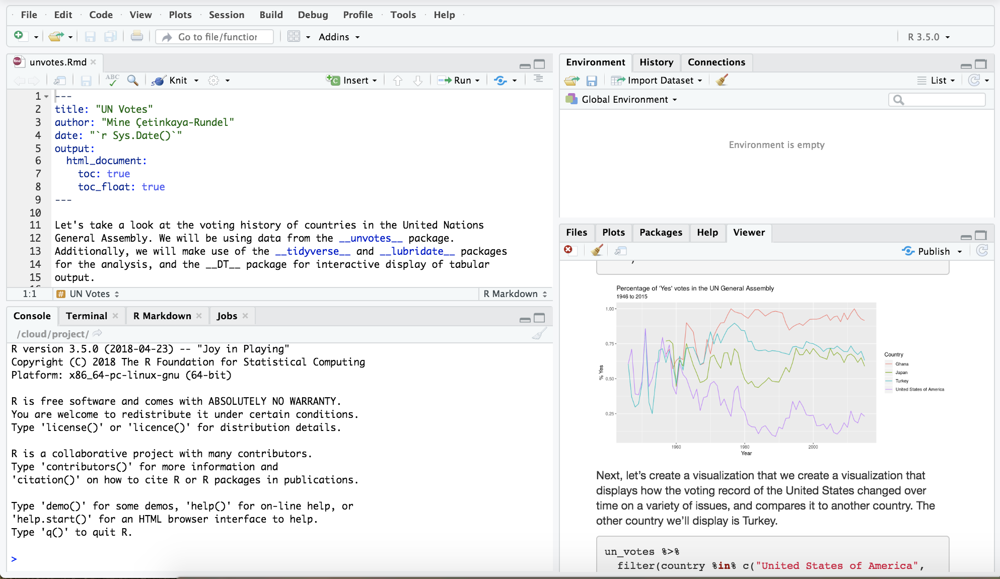

class: center, middle

# R

---

## Why R?

- Programming language for data analysis
- Free!
- Open source
- Widely used and supported across all disciplines
- Can be used on Windows, Mac OS X, or Linux
- Thousands (and growing) of statistical data analysis packages
- Relevant beyond the introductory statistics classroom

---

## Why not language X?

- A few languages that are commonly used for data science, one of the most 
popular being Python
- R has an accessible ecosystem for reproducible data science
- Once you master one language you'll find it easier to learn another

---

class: center, middle

# RStudio

---

## Why RStudio?

- RStudio is an integrated development environment for R
- Provides a user interface that's more approachable than the R shell and 
that helps keep your work organized
- Gives you a single environment to combine your documentation and your
analysis

---

class: center, middle

---

## Looking forward

Other reasons for using RStudio that tie into important learning goals that 
we will cover throughout this workshop:

- Literate programming with R Markdown
- Version control with Git and GitHub
- Student access to computing without installation

