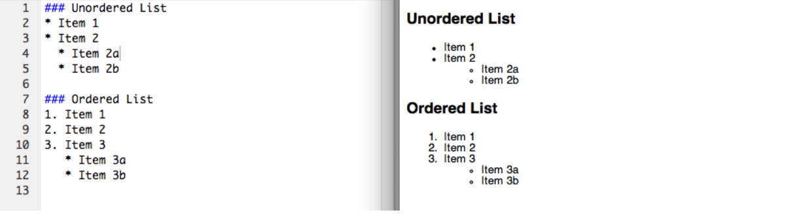
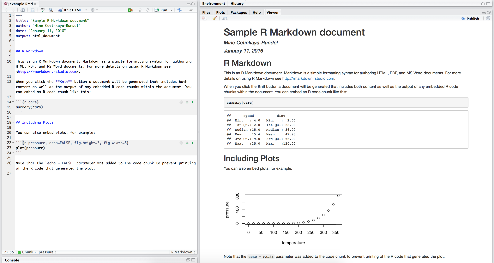
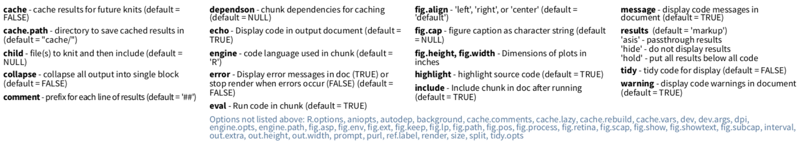

class: center, middle

# Literate Programming

---

## Donald Knuth "Literate Programming (1983)"

"Instead of imagining that our main task is to instruct a *computer* what 
to do, let us concentrate rather on explaining to *human beings* what we 
want a computer to do."

"The practitioner of literate programming [...] strives for a program that 
is comprehensible because its concepts have been introduced in an order 
that is best for human understanding, using a mixture of formal and 
informal methods that reinforce each other."

- These ideas have been around for years!
- And tools for putting them to practice have also been around
- But they have never been as accessible as the current tools: R Markdown

---

## What is Markdown?

- Markdown is a lightweight markup language for creating HTML (or XHTML) 
documents.

- Markup languages are designed to produce documents from human readable 
text (and annotations).

- Some of you may be familiar with LaTeX. This is another (less human 
friendly) markup language for creating pdf documents.

- Why I love Markdown:
    + Simple syntax means easy to learn and use.
    + Focus on **content**, rather than **coding** and debugging 
    **errors**.
    + Allows for easy web authoring.
    + Once you have the basics down, you can get fancy and add HTML,
    JavaScript, and CSS.

---

## Sample Markdown document

---

## What is R Markdown?

Well, it's R + Markdown:

- Ease of Markdown syntax

- Rendering of R code to produce output and plots

- Ability to include LaTeX: $\hat{y} = \beta_0 + \beta_1 \times x$

---

## Sample R Markdown document

---

## Another R Markdown document

    

This presentation!

---

class: center, middle

# R Markdown

---

## It's your lucky day!

You got some data.

- `WorldCupMatches-01.csv`: Match info for each game in pre-2000 World Cups
- Codebook at https://github.com/mine-cetinkaya-rundel/teach-data-sci-icots2018/blob/master/01-04-rmarkdown/data/README.md
- Ultimate goal: Visualize the total number of goals for each World Cup over time.

.instructions[
Open `world-cup-goals.Rmd`. Knit the document. Then, update the **yaml** with your information, and knit again.
]

---

## The YAML

YAML: Yet another Markdown language

- Fields like `title`, `subtitle`, `author`, `date`
- You can also change `output` formats: `html_document` for web authoring, 
`github_document` for markdown document easily viewable on GitHub, 
`pdf_document` for PDF (requires TeX), `word_document` for MS Word 
(requires Word)
- Can use inline R code in values (see `date`)

---

## Chunk options

- Turn off messages with `message = FALSE`
- Turn off warnings with `warning = FALSE`
- Hide code with `echo = FALSE`
- Exclude chunk from doc with `include = FALSE` to prevent code and results from 
appearing in the finished file. Code in the chunk will still be ran, and the 
results can be used by other chunks.
- Display error messages in document with `error = TRUE`, as opposed to stopping 
render when errors occur `error = FALSE`, which is the default
- Set these per chunk or globally in a `setup` chunk on top of the document 
with `knitr::opts_chunk$set(...)`

---

## Not so lucky after all

.instructions[
Turns out there is an error in the data you received: The number of `home_team_goals` in 1998 by Brazil (in the game vs. Denmark played on 03 Jul 1998) should be 3, not 0. Implement a fix and redo the analysis.
]

---

## More data!

.instructions[
And now you received more data: World Cup matches post-2000. The data are in
`data/WorldCupMatches-02.csv`. Redo the analysis combining data from both files.
]

---

## Tips

- Make sure RStudio and the `rmarkdown` package (and its dependencies) are 
up-to-date.

--

- Get rid of your `.Rprofile`, especially if you have anything in there relating 
to `knitr`, `markdown`, `rmarkdown`, and RStudio.

--

- Set a global option for `error = TRUE` (or for a given chunk) so that your 
document renders even when there are errors.

--

- Don’t try to change working directory within an R Markdown document. (If you do still decide to use setwd in a code chunk, beware that the new working directory will only apply to that specific code chunk, and any following code chunks will revert back to use the original working directory.)
