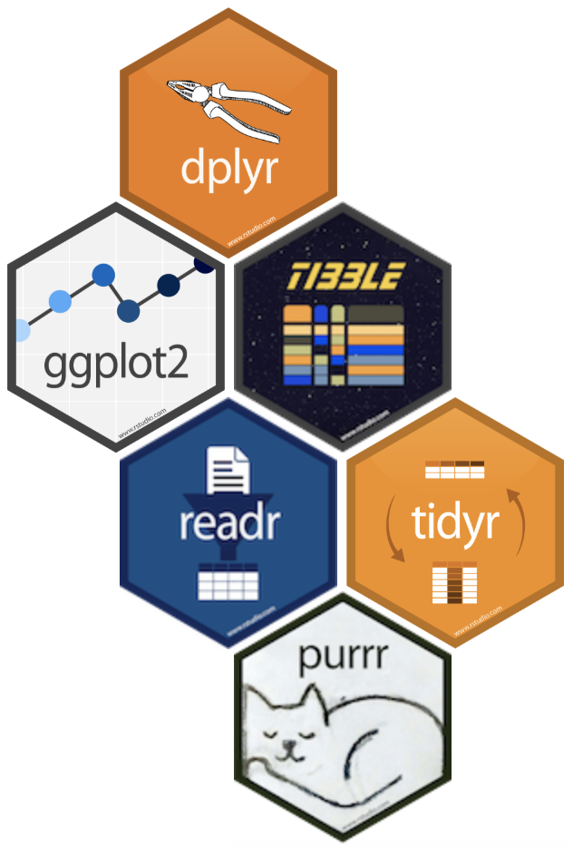

class: center, middle

# A few important goals

---

The course should 

- ask questions that students want to answer and equip students 
with the tools to answer questions of their own choosing
- emphasize modern and multivariate exploratory data analysis, and particularly 
multivariate data visualization

---

## MPG vs. displacement 

```{r base-mpg-displ, fig.height=5}
plot(mtcars$mpg ~ mtcars$disp)
```

---

## MPG vs. displacement

and transmission

```{r base-mpg-displ-trans, fig.height=5}
mtcars$trans_color <- ifelse(mtcars$am == 0, "green", "blue")
plot(mtcars$mpg ~ mtcars$disp, col = mtcars$trans_color)
legend("topright", 
       legend = c("automatic", "manual"), 
       pch = 1, col = c("green", "blue"))
```

---

## Need

syntax that doesn't grow exponentially with the complexity of the analysis!

---

class: center, middle

# Tidyverse

---

## What is the tidyverse?

.pull-left[

]
.pull-right[
- The tidyverse is an opinionated collection of R packages designed for data science. 
- All packages share an underlying design philosophy, grammar, and data structures.

```{r eval=FALSE}
install.packages("tidyverse")
```
```{r}
library(tidyverse)
```
]

---

## Tidyverse packages

- **dplyr**: Grammar of data manipulation
- **ggplot2**: System for declaratively creating graphics, based on The Grammar of Graphics
- **tibble**: Modern reimagining of the `data.frame`, keeping what time has proven to be effective, and throwing out what is not
- **readr**: Fast and friendly way to read rectangular data (like csv, tsv, and fwf)
- **tidyr**: Tools to help you create tidy data where each variable is in a column, 
each observation is a row, and rach value is a cell
- **purrr**: Functional programming toolkit

Learn more at [tidyverse.org/](https://www.tidyverse.org/)

---

## Recoding a binary variable

.pull-left[
**Base R:**

```{r base-recode-binary, eval=FALSE}
mtcars$transmission <- 
  ifelse(
    mtcars$am == 0, 
    "automatic", 
    "manual"
  )
```
]

--

.pull-right[
**tidyverse:**

```{r tidy-recode-binary}
mtcars <- mtcars %>%
  mutate(
    transmission = 
      case_when(
        am == 0 ~ "automatic",
        am == 1 ~ "manual"
      )
  )
```
]

---

## Recoding a multi-level variable

.pull-left[
**Base R:**

```{r base-recode-multilevel, eval=FALSE}
mtcars$gear_char <- 
  ifelse(
    mtcars$gear == 3, 
    "three", 
    ifelse(
      mtcars$gear == 4, 
      "four", 
      "five")
  )
```
]

--

.pull-right[
**tidyverse:**

```{r tidy-recode-multilevel}
mtcars <- mtcars %>%
  mutate(
    gear_char = 
      case_when(
        gear == 3 ~ "three",
        gear == 4 ~ "four",
{{       gear == 5 ~ "five"    }}
      )
  )
```
]

---

## Visualizing three variables

**Base R:**

```{r base-viz-three-vars, fig.height=4, fig.width=7}
mtcars$trans_col <- ifelse(mtcars$transmission == "automatic", 
                           "green", "blue")

plot(mtcars$mpg ~ mtcars$disp, col = mtcars$trans_col)

legend("topright", 
       legend = c("automatic", "manual"), 
       pch = 1, col = c("green", "blue"))
```

---

## Visualizing three variables (cont.)

**tidyverse:**

```{r tidy-viz-three-vars, fig.height=3.75, fig.width=7, dpi=300}
ggplot(data = mtcars, mapping = aes(x = disp, y = mpg, 
                                    color = transmission)) +
  geom_point()
```

---

## Visualizing four variables

**Base R:**

```{r base-viz-four-vars, fig.height=2.75, dpi=200}
mtcars4 <- mtcars[mtcars$cyl == 4, ]
mtcars6 <- mtcars[mtcars$cyl == 6, ]
mtcars8 <- mtcars[mtcars$cyl == 8, ]

par(mfrow = c(1, 3))
plot(mpg ~ disp, data = mtcars4, col = trans_col, main = "Cyl 4")
plot(mpg ~ disp, data = mtcars6, col = trans_col, main = "Cyl 6")
plot(mpg ~ disp, data = mtcars8, col = trans_col, main = "Cyl 8")
legend("topright", legend = c("automatic", "manual"), 
       pch = 1, col = c("green", "blue"))
```

---

## Visualizing four variables

**tidyverse:**

```{r tidy-viz-four-vars, fig.height=3.75, fig.width=7, dpi=300}
ggplot(data = mtcars, mapping = aes(x = disp, y = mpg, 
                                    color = transmission)) +
  geom_point() +
{{ facet_wrap(~ cyl)  }}
```
