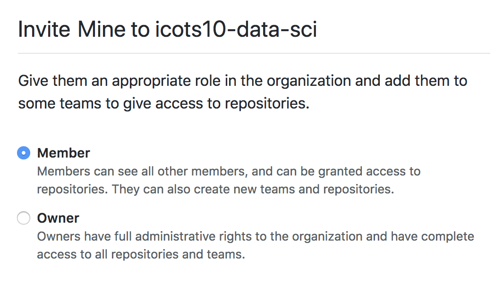
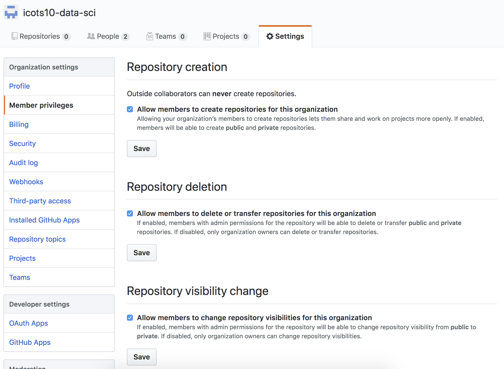
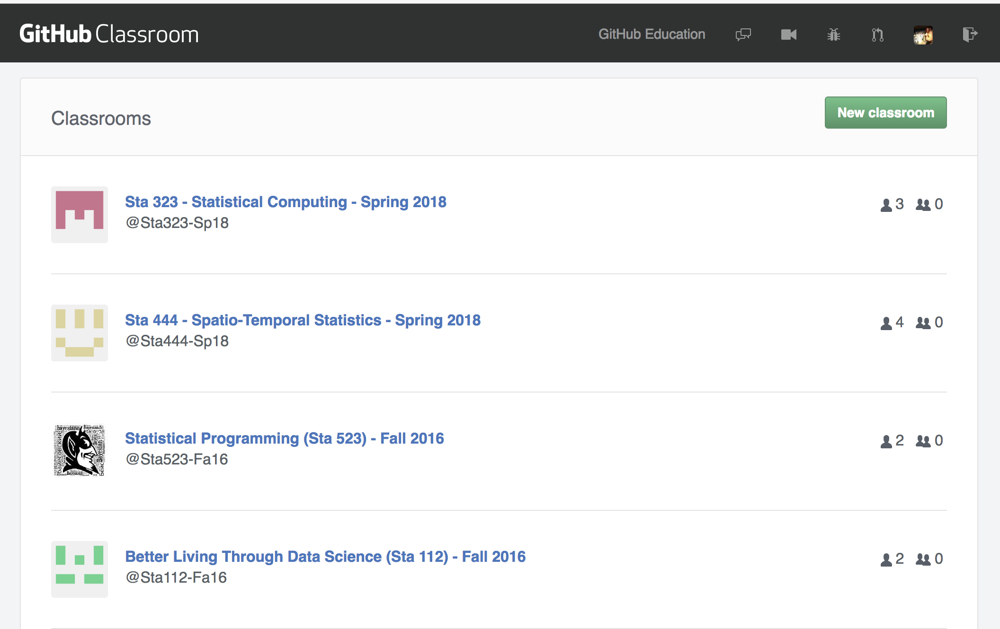
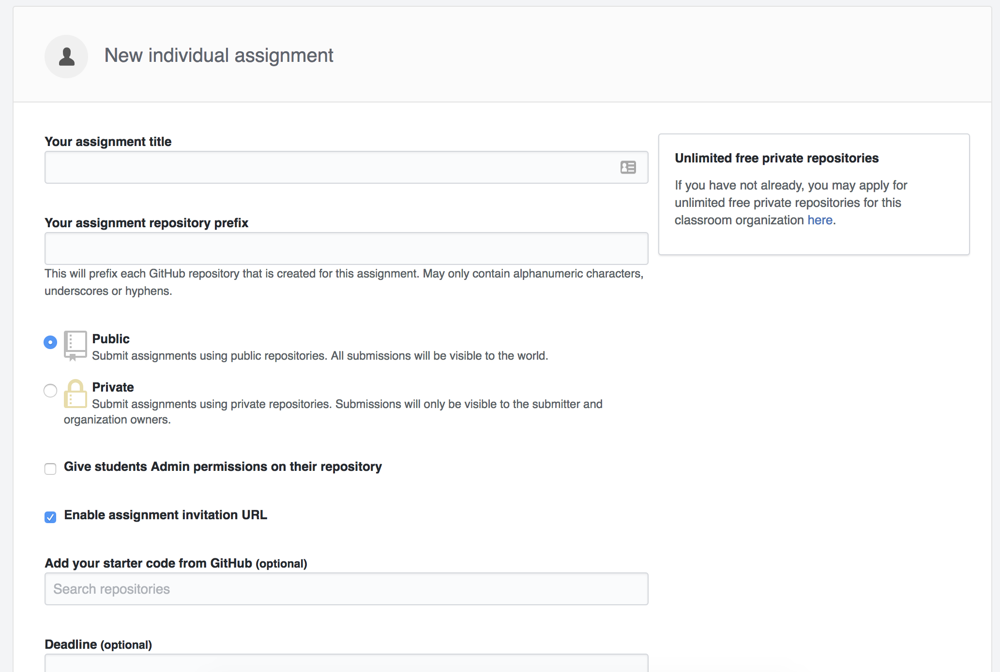

## GitHub accounts

<br/>

Enter your GitHub account in the following google sheet:

<br/>

.center[.large[
http://bit.ly/icots-gh
]]

---

## Goals

* Centralize the distribution and collection of all student assignments

* Force students to use version control

---

## Basic Structure

On Github:

* 1 Organization / class

* 1 repo / team / assignment

* Student and team repos are all private by default

* Template repos are public by default

---

## Setting up a course

1. Create course organization on GitHub (https://github.com/organizations/new)

2. Request education discount for organization (https://education.github.com/discount)

3. Invite students to organization

4. Create assignment(s).

---

## 1. Create course organization

.center[

]

---

## 2. Request education discount

.center[


...


]

---

## Required information

When requesting the discount you will need to provide the following:

* A brief description of the purpose for the GitHub organization and how you plan to use GitHub

* Establishing connection to an academic institution by verifying with an `.edu` email + photo of your school id.

* Link to relevant website for the class / workshop / research group

<br/>

Verification is manual and can take between a couple hours to a couple days.

---

## 3. Invite students

.center[



]

---

## Member Privledges

.center[

]

---

## Automating Invitations

Inviting students to the organization only needs to be done once be class, but the process gets tedious for more than a handful of students.

<br/>

We have developed an R package that automates this (and other class related tasks) called `ghclass`. 

The package is still under active development and is not currently on CRAN but can be installed from GitHub using:
```{r eval=FALSE}
devtools::install_github("rundel/ghclass")
```

---

## Aside - GitHub tokens

`ghclass` uses the GitHub API to interact with your course organization and repos - the API verifies your identity using a personal access token which must be created and saved in such a way that `ghclass` can find and use it.

These tokens can be created [here](https://github.com/settings/tokens) and once created should be saved to `~/.github/token` or assigned to the `GITHUB_TOKEN` environmentval variable.

---

## Checking tokens

If the token is found and works correctly the following code should run without error,
```{r error=TRUE, message=FALSE}
library(ghclass)
test_github_token()
```

If instead the token is invalid or not found, you will see something like the following,

```{r error=TRUE, message=FALSE}
test_github_token("MADE_UP_TOKEN")
```

---

## ghclass - Inviting students

```{r eval=FALSE}
users <- c("Alice", "Bob", "Carol", "Dave", "Eve")

invite_user("icots10-data-sci", users, verbose = TRUE)
```

```
## Adding Alice to icots10-data-sci ...
## Adding Bob to icots10-data-sci ...
## Adding Carol to icots10-data-sci ...
## Adding Dave to icots10-data-sci ...
## Adding Eve to icots10-data-sci ...
```

---

## ghclass - Student status

```{r}
get_members("icots10-data-sci")
```

```{r}
get_pending_members("icots10-data-sci")
```

---

## 4. Create assignment(s)

There are a few moving parts here, so we will break it down into several steps. For each assignment we do the following:

1. Create a (public) template repository that contains starter documents for an assignment

2. Create (private) individual / team repositories

3. Copy the contents of the template repository into the individual / team repositories

---

## 4.1 Template repository

.center[

]

---

## 4.2 Individual repos

```{r eval=FALSE}
users = c("Alice","Bob","Carol","Dave","Eve")

create_individual_repo("icots10-data-sci", users, 
                       prefix = "hw01-")
```

```
## Creating hw01-Alice for Alice ...
## Creating hw01-Bob for Bob ...
## Creating hw01-Carol for Carol ...
## Creating hw01-Dave for Dave ...
## Creating hw01-Eve for Eve ...
```

---

## 4.3 Copy template

```{r eval=FALSE}
mirror_repo(
  source_repo = "icots10-data-sci/hw01", 
  target_repos = get_repos("icots10-data-sci","hw01-")
)
```

```
## Cloning source repo (icots10-data-sci/hw01) ...
## Mirroring icots10-data-sci/hw01 to icots10-data-sci/hw01-Alice ...
## Mirroring icots10-data-sci/hw01 to icots10-data-sci/hw01-Bob ...
## Mirroring icots10-data-sci/hw01 to icots10-data-sci/hw01-Carol ...
## Mirroring icots10-data-sci/hw01 to icots10-data-sci/hw01-Dave ...
## Mirroring icots10-data-sci/hw01 to icots10-data-sci/hw01-Eve ...
## Cleaning up ...
```

---

## Exercise

You all now should have your own private copy of the demo repository within the `icots10-data-sci` organization.

* Go to the page for *your* hw01 repo

* Copy the *https* git url for your repo using the clone button.

* Use that url to create a new project in RStudio Cloud from git

* Complete theexercise and commit and push your work as described in `hw01.Rmd`.

<br/>

.midi[
*Reminder* - before you will be to push you will need to run the following commands in RStudio Cloud's terminal:

```shell
git config --global user.email "your email"
git config --global user.name "your name"
```
]

---

## Creating teams

GitHub supports the creation of teams within an organization, these teams can then be assigned a shared repository.

We can use ghclass to create these teams and add students to them.

```{r eval=FALSE}
users = c("Alice","Bob","Carol","Dave","Eve")
teams = c("Team01", "Team01", "Team01", "Team02", "Team02")

create_team("icots10-data-sci", unique(teams))
```

```
## Adding Team01 ...
## Adding Team02 ...
```

```{r eval=FALSE}
add_team_member("icots10-data-sci", users, teams)
```

```
## Adding Alice to Team01 ...
## Adding Bob to Team01 ...
## Adding Carol to Team01 ...
## Adding Dave to Team02 ...
## Adding Eve to Team02 ...
```

---

## Creating team assignments

```{r eval=FALSE}
create_team_repo("icots10-data-sci", prefix="hw01-")
```
```
## Creating hw01-Team01 for Team01 ...
## Creating hw01-Team02 for Team02 ...
```

```{r eval=FALSE}
mirror_repo(
  source_repo = "icots10-data-sci/hw01", 
  target_repos = get_repos("icots10-data-sci","hw01-")
)
```
```
## Cloning source repo (icots10-data-sci/hw01) ...
## Mirroring icots10-data-sci/hw01 to icots10-data-sci/hw2-Team01 ...
## Mirroring icots10-data-sci/hw01 to icots10-data-sci/hw2-Team02 ...
## Cleaning up ...
```

---

## Alternative - GitHub classroom

Available here - https://classroom.github.com/classrooms

.center[

]

---

.center[

]